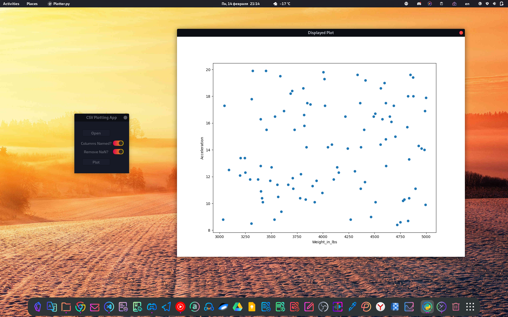

# Build GUI Apps with Python and GTK

[Source](https://youtu.be/Ko0NTS0IpfI)

## Get Started

### Windows

0. Go to <http://www.msys2.org> and download the x86_64 installer
1. Run `C:\msys64\mingw64.exe` -  a terminal window should pop up
2. `> pacman -Suy`
3. `> pacman -S mingw-w64-x86_64-gtk3 mingw-w64-x86_64-python3 mingw-w64-x86_64-python3-gobject mingw-w64-x86_64-glade`
4. `> python -m venv .venv`
5. `> source .venv/bin/activate`
6. `> pip install pygobject pandas matplotlib`

### macOS

0. Go to <https://brew.sh> and install homebrew
1. Open a terminal
2. `> brew install python pygobject3 gtk+3 glade`
3. `> python -m venv .venv`
4. `> source .venv/bin/activate`
5. `> pip install pygobject pandas matplotlib`

### Linux

0. Open a terminal
1. `> sudo apt install python3-gi python3-gi-cairo gir1.2-gtk-3.0 glade`
2. `> python -m venv .venv`
3. `> source .venv/bin/activate`
4. `> pip install pygobject pandas matplotlib`

## Further Resources

* PyGObject Getting Started: <https://pygobject.readthedocs.io/en/latest/>
* PyGObject Tutorials: <https://python-gtk-3-tutorial.readthedocs.io/en/latest/>
* Python GI API Reference: <https://lazka.github.io/pgi-docs>
